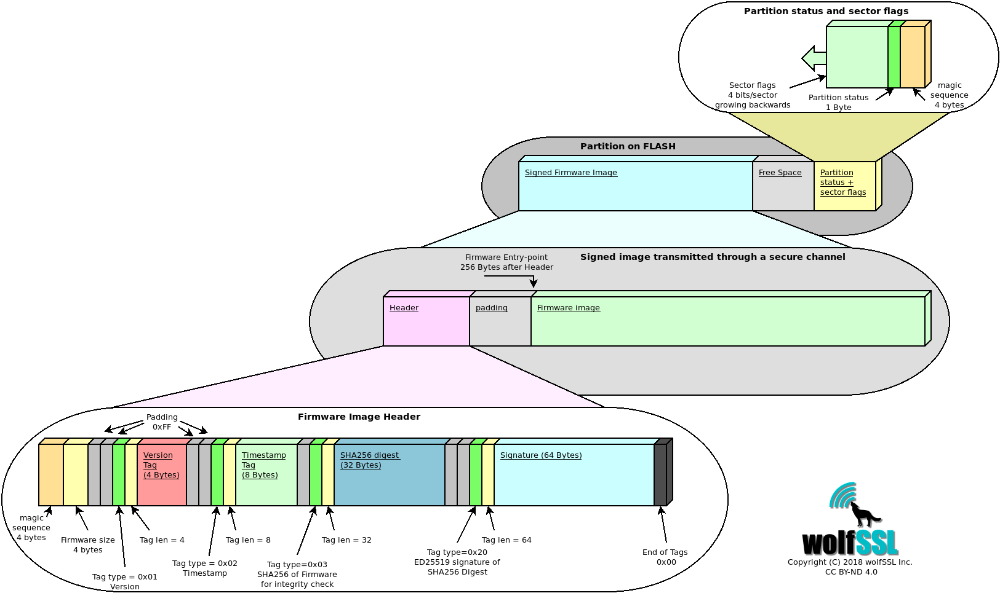

# Flash partitions

## Flash memory partitions

To integrate wolfBoot you need to partition the flash into 
separate areas (partitions), taking into account the geometry of the flash memory.

Images boundaries **must** be aligned to physical sectors, because the 
bootloader erases all the flash sectors before storing a new firmware image, and
swaps the content of the two partitions, one sector at a time.

For this reason, before proceeding with partitioning on a target system, the
following aspects must be considered:

  - BOOT partition and UPDATE partition must have the same size, and be able to contain the running system
  - SWAP partition must be as big as the largest sector in both BOOT and UPDATE partition.

The flash memory of the target is partitioned into the following areas:

  - Bootloader partition, at the beginning of the flash, generally very small (16-32KB)
  - Primary slot (BOOT partition) starting at address `WOLFBOOT_PARTITION_BOOT_ADDRESS`
  - Secondary slot (UPDATE partition) starting at address `WOLFBOOT_PARTITION_UPDATE_ADDRESS`
    - both partitions share the same size, defined as `WOLFBOOT_PARTITION_SIZE`
  - Swapping space (SWAP partition) starting at address `WOLFBOOT_PARTITION_SWAP_ADDRESS`
    - the swap space size is defined as `WOLFBOOT_SECTOR_SIZE` and must be as big as the 
      largest sector used in either BOOT/UPDATE partitions.

A proper partitioning configuration must be set up for the specific use, by setting
the values for offsets and sizes in [include/target.h](../include/target.h).

### Bootloader partition

This partition is usually very small, and only contains the bootloader code and data.
Public keys pre-authorized during factory image creations are automatically stored
as part of the firmware image.

### BOOT partition

This is the only partition from where it is possible to chain-load and execute a 
firmware image. The firmware image must be linked so that its entry-point is at address
`WOLFBOOT_PARTITION_BOOT_ADDRESS + 256`. 

### UPDATE partition

The running firmware is responsible of transferring a new firmware image through a secure channel,
and store it in the secondary slot. If an update is initiated, the bootloader will replace or swap
the firmware in the boot partition at the next reboot.


## Example 512KB partitioning on STM32-F407

The example firmware provided in the `test-app` is configured to boot from the primary partition
starting at address 0x20000. The flash layout is provided by the default example using the following
configuration in `target.h`:

```C
#define WOLFBOOT_SECTOR_SIZE			0x20000
#define WOLFBOOT_PARTITION_SIZE			0x20000

#define WOLFBOOT_PARTITION_BOOT_ADDRESS 0x20000
#define WOLFBOOT_PARTITION_UPDATE_ADDRESS 0x40000
#define WOLFBOOT_PARTITION_SWAP_ADDRESS 0x60000
```

which results in the following partition configuration:


This configuration demonstrates one of the possible layouts, with the slots
aligned to the beginning of the physical sector on the flash.

The entry point for all the runnable firmware images on this target will be `0x20100`, 
256 Bytes after the beginning of the first flash partition. This is due to the presence
of the firmware image header at the beginning of the partition, as explained more in details
in [Firmware image](firmware_image.md)

In this particular case, due to the flash geometry, the swap space must be as big as 64KB, to account for proper sector swapping between the two images.

On other systems, the SWAP space can be as small as 512B, if multiple smaller flash blocks are used.

More information about the geometry of the flash and in-application programming (IAP) can be found in the manufacturer manual of each target device.

## Partition status and sector flags

Partitions are used to store firmware images currently in use (BOOT) or ready to swap in (UPDATE).
In order to track the status of the firmware in each partition, a 1-Byte state field is stored at the end of 
each partition space. This byte is initialized when the partition is erased and accessed for the first time.

Possible states are:
  - `STATE_NEW` (0xFF): The image was never staged for boot, or triggered for an update. If an image is present, no flags are active.
  - `STATE_UPDATING` (0x70): Only valid in the UPDATE partition. The image is marked for update and should replace the current image in BOOT.
  - `STATE_TESTING` (0x10): Only valid in the BOOT partition. The image has been just updated, and never completed its boot. If present after reboot, it means that the updated image failed to boot, despite being correctly verified. This particular situation triggers a rollback.
  - `STATE_SUCCESS` (0x00): Only valid in the BOOT partition. The image stored in BOOT has been successfully staged at least once, and the update is now complete.

Starting from the State byte and growing backwards, the bootloader keeps track of the state of each sector, using 4 bits per sector at the end of the UPDATE partition. Whenever an update is initiated, the firmware is transferred from UPDATE to BOOT one sector at a time, and storing a backup of the original firmware from BOOT to UPDATE. Each flash access operation correspond to a different value of the flags for the sector in the sector flags area, so that if the operation is interrupted, it can be resumed upon reboot.

## Overview of the content of the FLASH partitions


